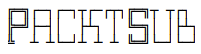

#### A Scala utility to download PacktPub Free Leaning contents
[](https://www.codacy.com/app/ubaldopescatore/packtsub?utm_source=github.com&amp;utm_medium=referral&amp;utm_content=P3trur0/packtsub&amp;utm_campaign=Badge_Grade)
---

## Description

**PacktSub** is a Scala subscriber to the Packt Publishing Free Learning resources.
Each day, on the Packt Publishing web site, a free title is available.

PacktSub logs in the Packt Publishing website, claims the free title of the day and sends a notification email about the claimed resource.

---

## Setup

This tool can be easily configured to run as a daily cron job.

First, you have to clone this repo.

Then, by running the following sbt task you can compile the source code and package all the scripts to run the CLI command starting PacktSub:

```scala

sbt compile stage

```

This task creates a batch script in the following path:

```bash
target/universal/stage/bin/packtsub
```

Calling this script, the application starts and tries to claim the free book of the day.

For example, if you will to run PacktSub each night at 03.00AM, you can schedule a cronjob as the following:

```bash
0 3 * * * /<PROJECT_LOCATION>/target/universal/stage/bin/packtsub
```

where `<PROJECT_LOCATION>` is the actual PacktSub location on your machine.

#### Environment configuration

To claim the book properly, PacktSub requires the Packt Publishing user credentials to log in the Packt website.

These credentials must be provided as environment variables named as:

- **PACKT_EMAIL**, your Packt username
- **PACKT_PWD**, your Packt password

If these are not properly provided, the tool will not perform any download.

#### Optional feature, SMTP notification

PacktSub offers also an optional mechanism to send notification e-mails about the occurred claim.
If you like to enable this feature, you have to configure also your SMTP information as environment variables.

These variables are named

- **PACKT_SMTP**, SMTP server to send email
- **PACKT_SMTP_USER**, SMTP user
- **PACKT_SMTP_PWD**, SMTP password

---

## Dependencies

PacktSub depends on a set of open source libraries:

- [Gigahorse](https://github.com/eed3si9n/gigahorse)
- [SSoup, my personal fork](https://github.com/P3trur0/ssoup)
- [ScalaTest](https://github.com/scalatest/scalatest)
- [Apache Commons Email](https://commons.apache.org/email/)
- [Typesafe Config](https://github.com/typesafehub/config)

---

## License

PacktSub is released under the Apache License Version 2.0

---

**PRs and comments are definitely welcome!**
